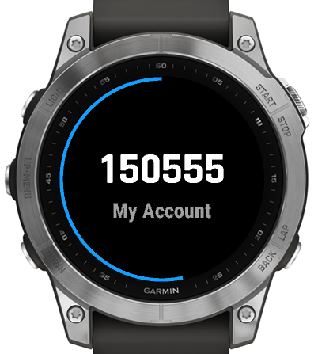
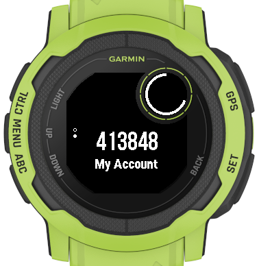

# 2FA Codes

2FA codes is a Connect IQ widget that generates Time-based one-time passwords used for 2-factor authentication. It is compatible with Google Authenticator and other similar systems.

## Usage

If your device supports glances then you'll get the widget in your glance list in one of the two forms
depicted in the pictures below.

 

If the devices is powerful enough to support live updates you'll see the code for the last account you
opened and shrinking progress bar showing you how soon the code will change.

If live updates are not supported (or you have not configured any accounts yet) you'll see just the name
of the widget. 

Activating the glance (with a tap and/or select button) will open the full widget. If your device doesn't support glances you will see the full widget in the list of widgets.

  

If there are more than one account configured you'll see dots indicating the active one on the left side of the screen.

Flick the screen or use up/down buttons to scroll through the accounts. You can use tap or select button to go through the accounts as well. If your device doesn't support glances, you will have to use select button/tap, as up/down buttons will scroll through the widgets.

**Why not always show auth code in glances?**

Garmin devices support two ways of showing widget glances, for a devices that have enough resources, the glances can be updated every second. That works perfectly as the current 2FA code can be shown and updated as necessary along with the countdown bar that shows time till the code change.

Devices that have less resources will give an application a change to update the glance only once. There is no way to know when the glance could be updated next time. The only guarantee is that will not happen in the next 30 seconds. Given than most (if not all) 2FA codes have a time window of 30 seconds there are good chances that the code displayed in the widget glance is out of date by the time you use it to authenticate. It might work, depending on the authentication server status, but it is way more reliable just to open the full widget and have up to date code displayed along with countdown timer.

See the table below to check which devices support live updates.

## Set up

See examples in the [wiki](https://github.com/uaraven/otpauth-ciq/wiki)

## Compatibility

2FA Auth should run on any Garmin watch supporting Connect IQ version 3.1 or higher. 
If the "Glances" column contains word "Live" then live updates for glances are supported for the device. 

Devices listed in the table below were tested at least with the simulator. Bear in mind that Garmin simulator is not 100% accurate and therefore there might be various problems with some devices that were not detected. [Open an issue]((https://github.com/uaraven/otpauth-ciq/issues)) and describe the problem to get it fixed.

| Device                            | Glances   |
|:----------------------------------|:---------:|
| Fenix 5/5s/5x                     | No        |
| Fenix 5 plus/5s plus/5x plus      | No        |
| Fenix Chronos                     | No        |
| Fenix 6                           | Yes       |
| Fenix 6pro                        | Yes, Live |
| Enduro                            | Yes, Live |
| Venu                              | No        | 
| Venu Mercedes-Benz                | No        | 
| Venu Sq/Sq Music                  | No        |
| Venu 2/2s/2plus                   | Yes, Live | 
| Fenix 7/7s/7x                     | Yes, Live |
| Epix 2                            | Yes, Live |
| Forerunner 55                     | Yes       |
| Forerunner 245                    | Yes       |
| Forerunner 245 Music              | Yes, Live |
| Forerunner 645/645 Music          | No        |
| Forerunner 745                    | Yes, Live |
| Forerunner 935                    | Yes       |
| Forerunner 945/945LTE             | Yes, Live |
| Vivoactive 3/3 Music /3 Music LTE | No        |
| Vivoactive 4/4s                   | No        |
| Instinct 2/2s                     | Yes       |
| D2 Air/Delta/Delta PX/Delta S     | No        |
| D2 Air X10                        | Yes, Live |
| Descent Mk2/Mk2i/Mk2 S            | Yes, Live |
| Rey, Darth Vader, Captain Marvel, First Avenger       | No        |
| MARQ (Various)                    | Yes       |

# License

The source code is released under the [MIT license](license.md)
