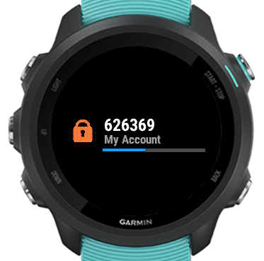
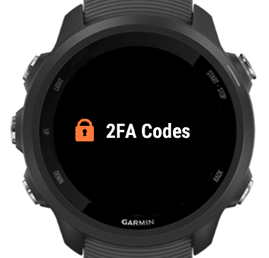

# 2FA Codes

2FA codes is a Connect IQ widget that generates Time-based one-time passwords used for 2-factor authentication. It is compatible with Google Authenticator and other similar systems.

## Usage

## Set up

## Supported devices

| Device                            | Glances   |
|:----------------------------------|:---------:|
| Fenix 5/5s/5x                     | No        |
| Fenix 5 plus/5s plus/5x plus      | No        |
| Fenix 6                           | Yes       |
| Fenix 6pro                        | Yes, Live |
| Venu Sq, Sq Music                 | No        | 
| Fenix 7/7s/7x                     | Yes, Live |
| Epix 2                            | Yes, Live |
| Venu 2/2s/2plus                   | Yes, Live |
| Forerunner 245                    | Yes       |
| Forerunner 245 Music              | Yes, Live |
| Forerunner 645/645 Music          | No        |
| Forerunner 745                    | Yes, Live |
| Forerunner 935                    | Yes       |
| Forerunner 945/945LTE             | Yes, Live |
| Vivoactive 3/3 Music /3 Music LTE | No        |
| Vivoactive 4/4s                   | No        |
